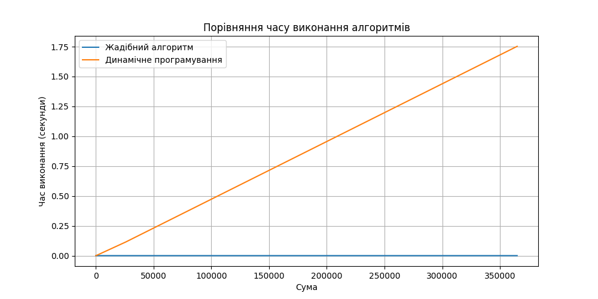

### Висновки щодо ефективності жадібного алгоритму та алгоритму динамічного програмування
#### Жадібний алгоритм 
проявляє високу швидкість на всіх сумах, оскільки він обирає 
найбільшу можливу монету на кожному кроці. 
Основна перевага жадібного алгоритму полягає у його простоті та швидкості. Це робить його відмінним 
вибором для задач, де монети мають такі номінали, що жадібний підхід завжди забезпечує оптимальне рішення 
(наприклад, монети 1, 5, 10, 25, 50).

#### Алгоритм динамічного програмування 
Більш повільний через свою комплексність у побудові таблиці, показує значно гірші результати 
при роботі з великими сумами. Це пов'язано з тим, що алгоритм розраховує мінімальну кількість монет для 
кожної можливої суми, що гарантує оптимальність результату. Динамічне програмування ефективне в умовах, де 
жадібний алгоритм може не дати оптимального рішення. 

#### Аналіз продуктивності
показує, що при збільшенні суми час виконання алгоритму динамічного програмування 
зростає, але цей метод залишається надійним для забезпечення точності рішення. Жадібний алгоритм 
виявляється швидшим, але може давати неоптимальні результати для деяких наборів монет. Наприклад, для 
номіналів 1, 3, 4 та сумі 6 буде запропоновано неоптимальний набір.
Хоча для заданого у коді набору неоптимальний варіант при тестах не траплявся.